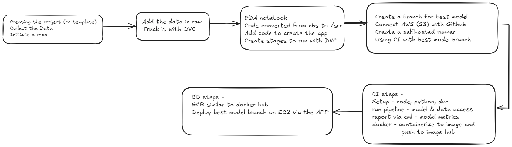

# Project: Data Science CI/CD Pipeline with DVC, Docker, and AWS

A complete end-to-end Machine Learning project to build an end-to-end working app for the NYC taxi duration challenge.

## Overview

This project implements a Continuous Integration and Continuous Deployment (CI/CD) pipeline for a data science project using **DVC (Data Version Control)**, **Docker**, and **AWS**. The pipeline automates data tracking, model building, and deployment to an **AWS EC2 instance**. The objective is to create an end-to-end solution that enables scalable and reproducible machine learning model development.

## Architecture Overview

The project workflow follows these key steps:

### 1. **Creating the Project**

   - **Template Initialization**: The project starts by initializing a repository with a clean template. The repository will serve as the version control system for both code and data.
   - **Data Collection**: The necessary data is collected and organized for further analysis.
   - **Git Repository**: A Git repository is initiated to track changes in the project codebase.

### 2. **Data Tracking with DVC**

   - **Adding Raw Data**: The collected data is added to the project in a raw format.  
   - **DVC for Data Tracking**: Data is tracked using DVC to ensure the data versioning process is streamlined and reproducible. This allows for efficient tracking of changes in data and synchronization between local and remote storage (e.g., AWS S3).

### 3. **Exploratory Data Analysis (EDA)**

   - **EDA Notebook**: A Jupyter notebook is used for exploratory data analysis, allowing for initial insights and data visualization.
   - **Code Conversion**: The EDA notebook is converted into modular scripts that are moved to the `/src` folder to enhance maintainability.
   - **Creating Stages in DVC**: Stages are defined using DVC to track each stage of the data pipeline (from raw data to final model output). These stages include data preprocessing, feature extraction, and model training.

### 4. **Branching for Best Model**

   - **Creating a Branch**: A separate Git branch is created to track the best model identified during the training process.
   - **AWS S3 and GitHub Integration**: AWS S3 is connected to GitHub for efficient storage and retrieval of large files using DVC.
   - **Self-Hosted Runner Setup**: A self-hosted runner is configured for continuous integration, allowing automated testing and model validation directly from the GitHub repository.

### 5. **Continuous Integration (CI)**

   The Continuous Integration process includes the following steps:
   - **Setup**: Setting up the environment by configuring dependencies (Python, DVC, etc.).
   - **Run Pipeline**: Running the data pipeline, which includes accessing the model and data, followed by training and evaluation.
   - **Reporting**: Using **CML (Continuous Machine Learning)** to generate reports that capture model metrics and performance.
   - **Containerization**: The model and necessary components are containerized using **Docker**, creating an image that can be easily deployed.

### 6. **Continuous Deployment (CD)**

   The Continuous Deployment process includes the following steps:
   - **ECR (Elastic Container Registry)**: Similar to Docker Hub, the ECR repository is used to store Docker images.
   - **EC2 Deployment**: The best model branch is deployed on **AWS EC2** using the built Docker image.
   - **Automation**: The entire process is automated to trigger on changes to the `best model` branch, ensuring the latest model version is deployed without manual intervention.

## How to Use This Project

### Prerequisites

- Python 3.x
- Docker
- DVC (Data Version Control)
- AWS Account (EC2 and S3)
- Git and GitHub
- CML (Continuous Machine Learning) for CI

